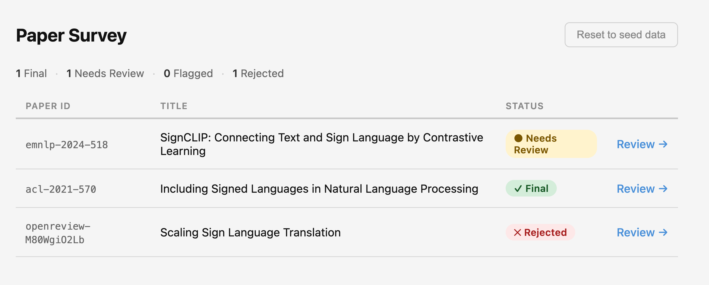
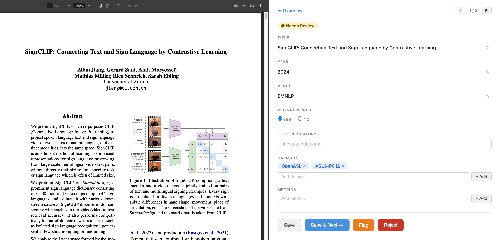

# repro-sign-survey-ui

[](https://github.com/bricksdont/repro-sign-survey-ui/actions/workflows/ci.yml)

A lightweight web interface for annotating and reviewing reproducibility metadata of NLP research papers. Built for a survey of sign language papers.

An overview page lists all papers with their review status. Each paper opens a detail view showing the PDF on the left and editable metadata fields on the right. Annotations are saved to a shared PocketBase backend, enabling multiple reviewers to work concurrently.





## Features

- Overview page with paper list, status badges (Needs Review / Final / Flagged / Rejected), and stats
- Search by paper ID or title; filter by status; live result count
- "Review Next →" button picks a random unreviewed paper
- Native browser PDF viewer via local proxy (text selection, zoom, full controls)
- Pre-filled fields shown read-only with one-click editing
- Tag chip inputs for datasets, metrics, and code repositories (with autocomplete for datasets and metrics)
- Code repository chips are clickable links opening in a new tab
- Status workflow: Save or Save & Next marks a paper as Final; Flag prompts for a reason (for team discussion); Reject prompts for a reason
- Flagged and Rejected statuses are preserved on Save; can be cleared via an inline link
- Paper navigation (◀ ▶); each paper has a stable URL (`paper.html?id=<id>`) with a one-click Copy link button
- Saves to a shared PocketBase backend — changes are immediately visible to all reviewers
- Edit locking: only one reviewer can edit a paper at a time; others see a read-only notice
- Session-based auth: login with a PocketBase user account; token stored in sessionStorage

## Metadata fields

| Field | Notes |
|-------|-------|
| Title | Free text |
| Year | Integer |
| Venue | Conference/workshop abbreviation (e.g. EMNLP, ACL) |
| Peer-Reviewed | Yes / No radio |
| Code Repositories | Multi-value URL list; entries are clickable links |
| Datasets | Multi-value tag list with autocomplete |
| Metrics | Multi-value tag list with autocomplete |

## Running

Requires a running PocketBase backend (see [backend repo](https://github.com/bricksdont/repro-sign-survey-backend)) and a user account.

```bash
python3 server.py
```

Then open [http://localhost:8765](http://localhost:8765). You will be redirected to a login page — enter your PocketBase email and password. The session token is stored in `sessionStorage` and cleared when the browser tab is closed.

`server.py` is a small wrapper around Python's built-in HTTP server that adds a `/pdf/<id>.pdf?url=<encoded>` proxy endpoint. This lets the browser's native PDF viewer embed PDFs from any host (including OpenReview, which sets `X-Frame-Options: SAMEORIGIN`) by fetching them server-side and stripping restrictive headers.

## Development

CI runs on every push and pull request. To run the checks locally:

```bash
# Python syntax and JSON schema
python3 -m py_compile server.py
python3 scripts/validate_data.py

# HTML validation (requires Node)
npm install
npx playwright install chromium   # first time only
npm run validate:html

# Playwright smoke tests — require a running PocketBase backend and user credentials
PB_TEST_EMAIL=you@example.com PB_TEST_PASSWORD=yourpassword npx playwright test
```

The Playwright tests auto-start `server.py` on port 8765 (or reuse an already-running instance) and authenticate against PocketBase before each test. Without the `PB_TEST_EMAIL` / `PB_TEST_PASSWORD` environment variables the tests are skipped rather than failed, so CI passes without a backend.

## Running without a backend

If you want to try the tool without setting up a PocketBase instance, check out the `standalone` tag. That version stores everything in `localStorage` — no login, no backend, no shared state:

```bash
git checkout standalone
python3 server.py
# open http://localhost:8765
```

## Tech

Plain HTML/CSS/JS — no framework, no build step. Node is a dev-only dependency (HTML validation + Playwright tests). PocketBase is the backend (separate repo).
