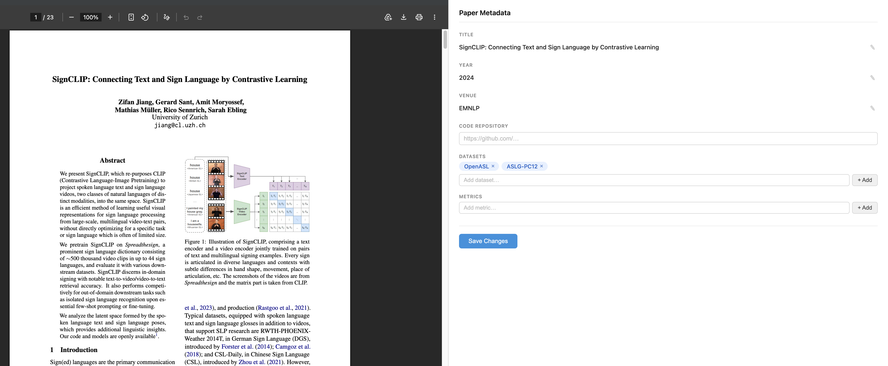

# repro-sign-survey-ui

A lightweight web interface for annotating and reviewing reproducibility metadata of NLP research papers. Built for a survey of sign language papers.

The interface shows the paper PDF on the left and editable metadata fields on the right. Annotations are saved locally in the browser.



## Features

- Inline PDF viewer (pdf.js with native browser fallback)
- Pre-filled fields shown read-only with one-click editing
- Tag chip inputs for multi-value fields (datasets, metrics)
- Saves to `localStorage` — survives page refresh, no backend needed

## Metadata fields

| Field | Notes |
|-------|-------|
| Title | Free text |
| Year | Integer |
| Venue | Conference/workshop abbreviation (e.g. EMNLP, ACL) |
| Code Repository | URL to accompanying code |
| Datasets | Multi-value tag list |
| Metrics | Multi-value tag list |

## Running

Requires a local HTTP server (the page fetches `data.json`):

```bash
python3 server.py
```

Then open [http://localhost:8765](http://localhost:8765).

`server.py` is a small wrapper around Python's built-in HTTP server that adds a `/proxy-pdf` endpoint. This lets pdf.js render PDFs from any host (including OpenReview, which blocks direct iframe embedding) by fetching them server-side.

## Seed data

Paper metadata lives in `data.json`. Leave unknown fields as `""` or `[]` — the form renders empty inputs for those. Edits are saved per-paper to `localStorage` (key: `paper:<id>`).

## Tech

Plain HTML/CSS/JS — no framework, no build step.
