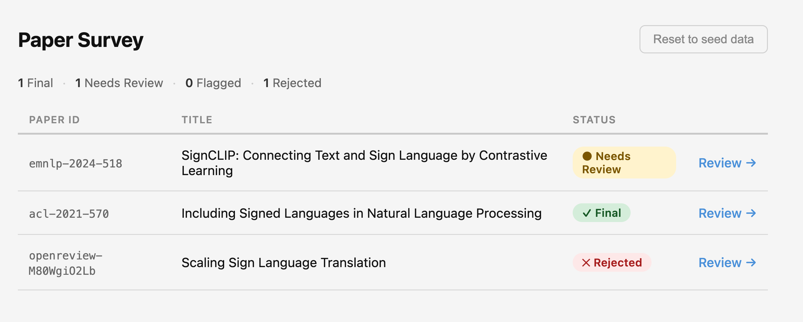
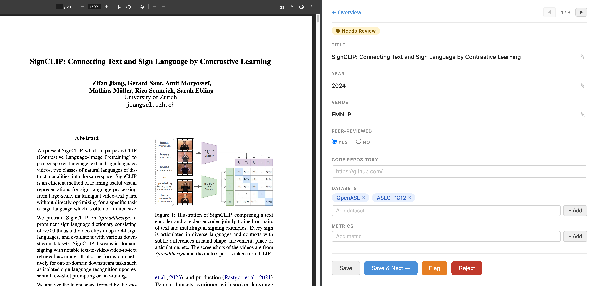

# repro-sign-survey-ui

[](https://github.com/bricksdont/repro-sign-survey-ui/actions/workflows/ci.yml)

A lightweight web interface for annotating research papers across two independent tasks: **Reviewing** (reproducibility metadata) and **Checking** (empirical scope). Built for a survey of sign language NLP papers.

A landing page routes annotators to either task. Each task has its own overview listing papers with status badges and a detail page showing the PDF on the left and editable fields on the right. A shared **Datasets catalogue** lets annotators browse, add, and edit the dataset records used across reviews. Annotations are saved to a shared PocketBase backend, enabling multiple annotators to work concurrently.





## Features

- Landing page with task cards routing to Reviewing, the Review Stats dashboard, the Datasets catalogue, the Metrics catalogue, and the Dataset Confirmation Tracker (Checking is reachable via a direct link but deliberately has no landing-page card for now)
- Version badge (`v<version>`) in the corner of the landing page, linking to the matching GitHub release
- Breadcrumb navigation (`Home → Reviewing` / `Home → Checking` / `Home → Datasets` / `Home → Metrics`) on all task pages

**Reviewing task** — add reproducibility metadata to papers:
- Overview with paper list, status badges (Needs Review / Final / Flagged / Rejected), stats
- Search by paper ID or title; filter by status; live result count; "Review Next →" for a random unreviewed paper
- Detail page: native browser PDF viewer (text selection, zoom, full controls) + metadata form
- Pre-filled fields (title, year, venue) shown read-only with one-click pencil editing
- Tag chip inputs for datasets, metrics, and code repositories (with autocomplete); code repo chips are clickable links; dataset/metric chips link to their detail page
- N/A confirm toggles for Code Repositories ("no repositories available") and Compute Requirements ("not specified in paper") — disables the input and saves `"N/A"` instead of an empty list/text
- Autosaves every field change 1 second after you stop editing, independent of status — a "Saving…" / "Saved ✓" indicator confirms it, and a pending edit is always flushed before switching papers or leaving the page
- Status workflow: Finalize / Finalize & Next → Final (disabled with a tooltip until every required field is filled, and while the paper is Flagged/Rejected); Flag → reason dialog (`flagged`); Reject → reason dialog (`rejected`, presets include "not in English", "no full text PDF", "requires specialized hardware"); inline clear/revert links
- Flag and reject reasons shown in the status badge text and as a tooltip
- Reviewer attribution: the logged-in email is saved to `finalized_by` only when a paper is Finalized, and shown next to the status badge once the paper is Final
- "Status History" button (next to Copy Link) opens a dialog listing every status change — who made it, from what to what, and when — newest first

**Checking task** — verify paper scope in an independent paper set:
- Overview with paper list, status badges (Needs Check / Flagged / Checked), stats; "Check Next →"
- Detail page: left panel shows the paper's abstract (plain text) when available, falling back to the PDF viewer otherwise
- Two scope questions: "Paper is on Sign Language Processing" (always shown); "Paper has empirical results" (only shown when SLP = Yes); both must be answered before Save / Save & Next become active
- Language field (editable), pre-filled from the screening pipeline; LLM-suggested answers for the scope questions are pre-filled and marked with an "LLM suggested" badge until confirmed by the reviewer
- Status workflow: Save / Save & Next → Checked; Flag → reason dialog; inline clear link
- Reviewer attribution: logged-in email saved to `checked_by` on every save, shown next to the Checked/Flagged badge

**Datasets catalogue** — manage the shared pool of datasets referenced in reviews:
- Overview table with name, license, availability badge, and URL; clicking a row opens the dataset detail page
- "+ Add Dataset" navigates to a blank detail page; saving POSTs a new record and updates the URL to `?id=<id>`
- Detail page has fields for name, license, URLs (chip list), availability, whether it's stored on Modal.com, correspondence status with the data owners, and comments; edit locking with 30-minute heartbeat
- Dataset chips on the review detail page show a ↗ icon that opens the dataset detail page in a new tab
- Detail page shows a scrollable "Used in Papers" list — every paper referencing this dataset, with a status badge, linking to the paper in a new tab

**Metrics catalogue** — manage the shared pool of metrics referenced in reviews:
- Overview table with name, URL, and comments; clicking a row opens the metric detail page
- "+ Add Metric" navigates to a blank detail page; saving POSTs a new record and updates the URL to `?id=<id>`
- Detail page has fields for name, URLs (chip list), and comments; same edit locking pattern as datasets
- Metric chips on the review detail page show a ↗ icon that opens the metric detail page in a new tab
- Detail page shows the same "Used in Papers" list as the dataset detail page

**Review Stats dashboard** — reviewing progress at a glance (named to distinguish it from any future Checking-task stats):
- Total paper count and a status breakdown bar chart (Needs Review / Final / Flagged / Rejected)
- Top reviewers by email — every status-change action (Finalize, Flag, Reject, Clear/Revert), not just Finalize, so flag/reject work is credited too
- Top datasets and top metrics used across all papers, linking to their catalogue detail pages in a new tab
- Breakdown of papers by Area of SLP
- A compact Yes/No/N-A/Unanswered table for Peer-Reviewed, Ranking, Copied Baseline Scores, Human Evaluation, and Ethical Concerns
- Computed entirely client-side from the `papers` collection — no backend aggregation endpoint, no charting library

**Dataset Confirmation Tracker** (`dataset-confirmation-index.html`) — every finalized paper, with an All / Confirmed / Unconfirmed filter: "Confirmed" means every dataset the paper uses has the same definitive availability answer (all available, or all unavailable — the investigation is settled either way); "Unconfirmed" covers a mix, or any dataset still unanswered. The active filter is reflected in the URL, so a filtered view is bookmarkable/shareable. Datasets render as clickable chips linking to their detail page, colored green/red/gray by availability. Each row also links to the paper's detail page in a new tab. A "Download JSON" button exports whatever's currently shown (respecting the active filter) as a JSON file, with per-editor locking fields stripped. Computed entirely client-side, same as Review Stats.

**Shared features:**
- Paper navigation (◀ ▶); each paper has a stable URL with a one-click Copy Link button. Opening a paper from a filtered/searched overview list carries that filter into the URL (`?q=`/`?status=`), keeping ◀ ▶ within that subset while browsing; a bare link always navigates the full collection. Copy Link always copies the plain `?id=` link, stripping any active filter — a shared link stays simple. Returning to the overview (e.g. via Back) restores the same search/filter, which also has a one-click × clear button
- Saves to a shared PocketBase backend — changes are immediately visible to all annotators
- Edit locking: only one annotator can edit a paper at a time; others see a read-only notice
- Auth: login with email/password or "Sign in with Slack" (OAuth2); token stored in `localStorage` with a 24-hour expiry, shared across tabs so copied paper links open without re-login
- Account menu: shows logged-in email and a logout button

## Metadata fields

### Reviewing

| Field | Notes |
|-------|-------|
| Title | Free text (pencil edit) |
| Year | Integer (pencil edit) |
| Venue | Conference/workshop abbreviation, e.g. EMNLP, ACL (pencil edit) |
| Peer-Reviewed | Yes / No / N/A radio |
| Code Repositories | Multi-value URL list; entries are clickable links; N/A confirm toggle available |
| Datasets | Multi-value tag list with autocomplete; chips link to the dataset detail page |
| Metrics | Multi-value tag list with autocomplete; chips link to the metric detail page |
| Area of SLP | Chip list with autocomplete from 12 fixed sub-areas (e.g. Translation, Recognition); any custom value also accepted |
| Sub-area of SLP | Chip list, same pattern; autocomplete suggestions depend on Area of SLP (Recognition/Translation each unlock their own fixed list); optional, not required to Finalize |
| Has Ranking | Yes / No radio (initially unanswered) |
| Human Evaluation | Yes / No radio (initially unanswered) |
| What to Reproduce | Free-text textarea |
| Compute Requirements | Free-text textarea; N/A confirm toggle available |
| Textual Conclusion | Free-text textarea |
| Potential Ethical Concerns | Yes / No radio (optional) |

### Checking

| Field | Notes |
|-------|-------|
| Title | Read-only display |
| Year | Editable (pencil button) |
| Language | Editable (pencil button); pre-filled from screening pipeline |
| Paper is on Sign Language Processing | Yes / No radio (required before Save; may be pre-filled by LLM filter) |
| Paper has empirical results | Yes / No radio (only shown when SLP = Yes; required before Save; may be pre-filled by LLM filter) |

## Deployment

The frontend is deployed to Fly.io as a Docker container running `server.py`. The live URL is **https://repro-sign-survey-frontend.fly.dev** — anyone with a PocketBase account can log in there directly without running anything locally.

To redeploy after changes:

```bash
fly deploy
```

When accessed from the deployed URL, `api.js` automatically points at the Fly.io PocketBase backend (`https://repro-sign-survey-backend.fly.dev`) — no configuration needed.

To deploy from scratch:

```bash
fly apps create repro-sign-survey-frontend
fly deploy
```

### PDF fallback via Cloudflare R2

Some papers' PDFs are dead links or paywalled. As a preparation step those PDFs get downloaded and uploaded to a private Cloudflare R2 bucket, one object per paper named `<paper_id>.pdf`. If the direct fetch fails, `server.py`'s `/pdf/` proxy automatically retries via R2 — no changes to `papers.pdf_url` needed. Enable it by setting four Fly secrets:

```bash
fly secrets set R2_ACCOUNT_ID=... R2_ACCESS_KEY_ID=... R2_SECRET_ACCESS_KEY=... R2_BUCKET_NAME=...
```

Without these secrets set (or without `boto3` installed locally), the fallback is silently skipped and the original fetch error is returned as before.

## Running the frontend server locally

Run the local server only if you need to develop or test the frontend:

```bash
python3 server.py
```

Then open [http://localhost:8765](http://localhost:8765). You will be redirected to a login page — enter your PocketBase email and password, or use "Sign in with Slack". The token is stored in `localStorage` and expires after 24 hours.

`server.py` is a small wrapper around Python's built-in HTTP server that adds a `/pdf/<id>.pdf?url=<encoded>` proxy endpoint. This lets the browser's native PDF viewer embed PDFs from any host (including OpenReview, which sets `X-Frame-Options: SAMEORIGIN`) by fetching them server-side and stripping restrictive headers. No extra Python packages are required to run the app — `pip install -r requirements.txt` is only needed if you want to test the [R2 PDF fallback](#pdf-fallback-via-cloudflare-r2) locally, and you'd also need to export the same four `R2_*` variables in your shell.

## Backend

The frontend picks a backend by checking `window.location.hostname` — the hostname of the page URL in your browser's address bar:

- **`localhost`** → `http://localhost:8090` (local dev instance, see [backend repo](https://github.com/bricksdont/repro-sign-survey-backend))
- **Any other host** → `https://repro-sign-survey-backend.fly.dev` (live Fly.io deployment)

So opening `http://localhost:8765` automatically talks to the local backend, and opening the same frontend from any deployed URL automatically talks to Fly.io — no config needed.

You can override the auto-detection with a `?backend=` URL parameter on any page:

```
http://localhost:8765?backend=remote   # point local frontend at the live backend
http://localhost:8765?backend=local    # force local backend from any host
```

The override is persisted in `localStorage` as `pb_backend`, so it survives page navigation and logout — you only need to set it once per browser.

## Development

CI runs on every push and pull request. To run the checks locally:

```bash
# Python syntax and JSON schema
python3 -m py_compile server.py
python3 scripts/validate_data.py

# HTML validation (requires Node)
npm install
npx playwright install chromium   # first time only
npm run validate:html

# Playwright smoke tests — require a running PocketBase backend and user credentials
PB_TEST_EMAIL=you@example.com PB_TEST_PASSWORD=yourpassword npx playwright test
```

The Playwright tests auto-start `server.py` on port 8765 (or reuse an already-running instance) and authenticate against PocketBase before each test. Without the `PB_TEST_EMAIL` / `PB_TEST_PASSWORD` environment variables the tests are skipped rather than failed, so CI passes without a backend.

### Releasing

`package.json`'s `version` field is the single source of truth for the version badge shown on the landing page. Cut a release with:

```bash
npm version patch   # or minor / major
git push --follow-tags
```

`npm version` bumps `package.json`, commits it, and creates the matching `vX.Y.Z` git tag in one step, so the two can never drift apart.

## Running without a backend

If you want to try the tool without setting up a PocketBase instance, check out the [`standalone`](https://github.com/bricksdont/repro-sign-survey-ui/tree/standalone) tag. That version stores everything in `localStorage` — no login, no backend, no shared state:

```bash
git checkout standalone
python3 server.py
# open http://localhost:8765
```

## Tech

Plain HTML/CSS/JS — no framework, no build step. Node is a dev-only dependency (HTML validation + Playwright tests). PocketBase is the backend (separate repo).
